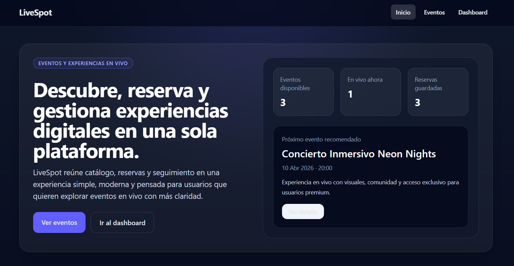
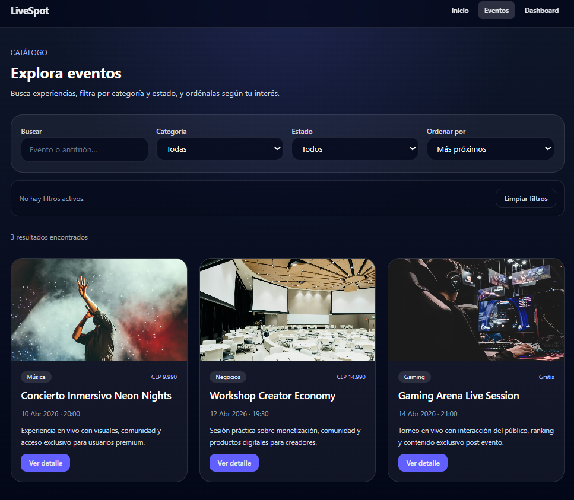
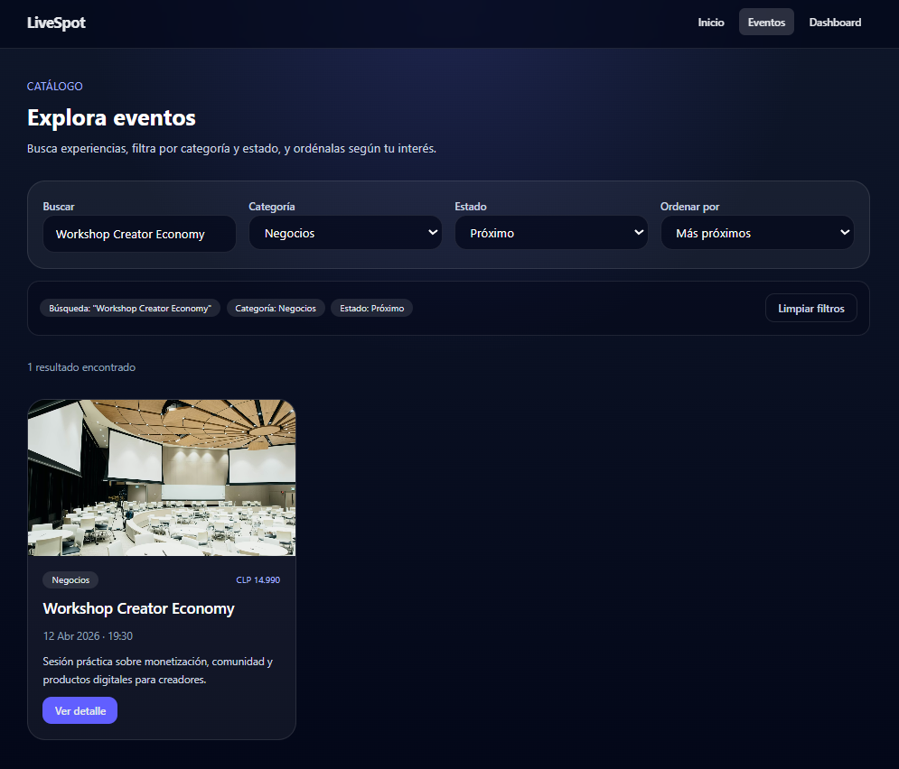
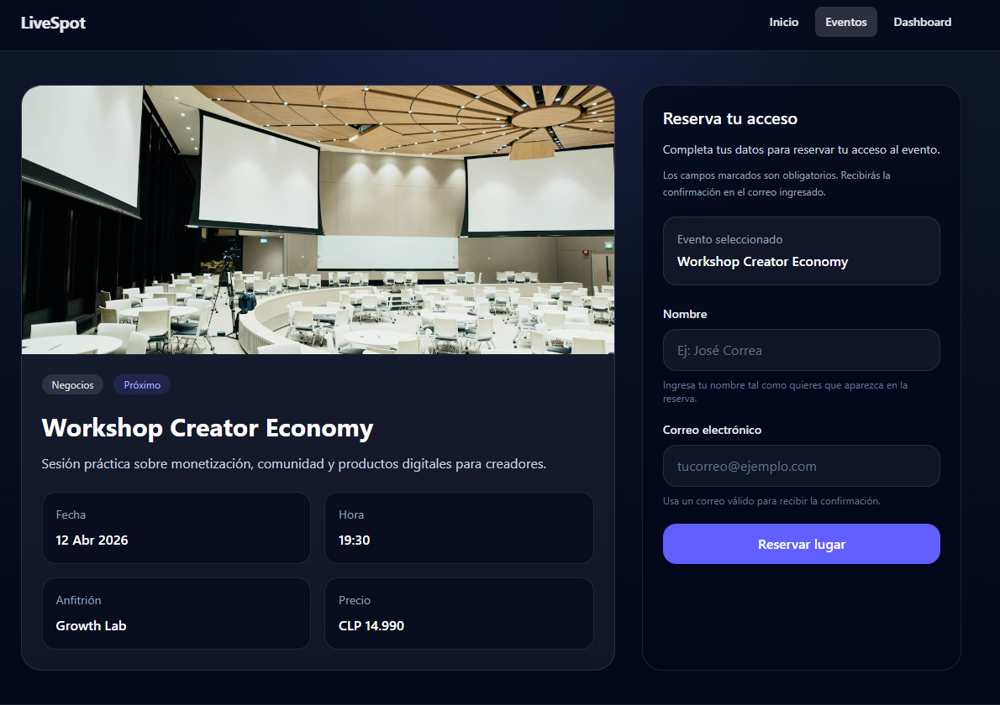
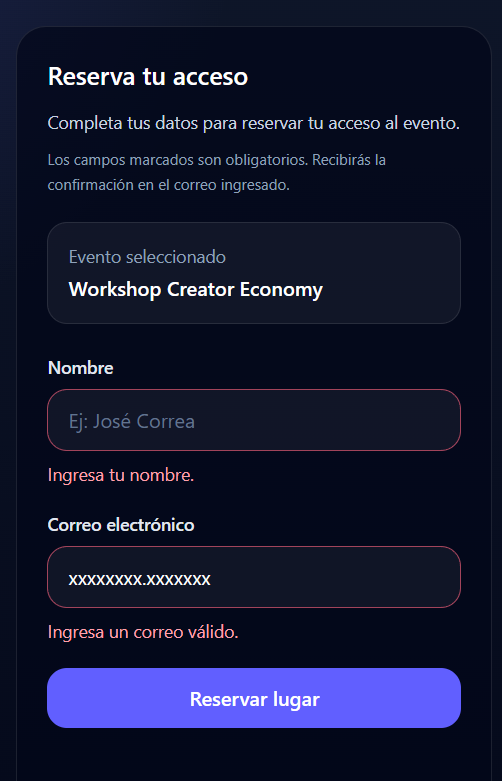
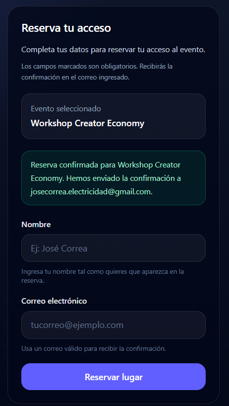
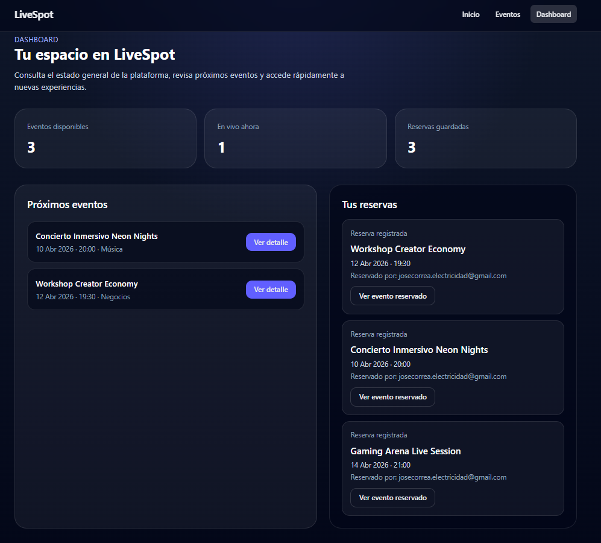
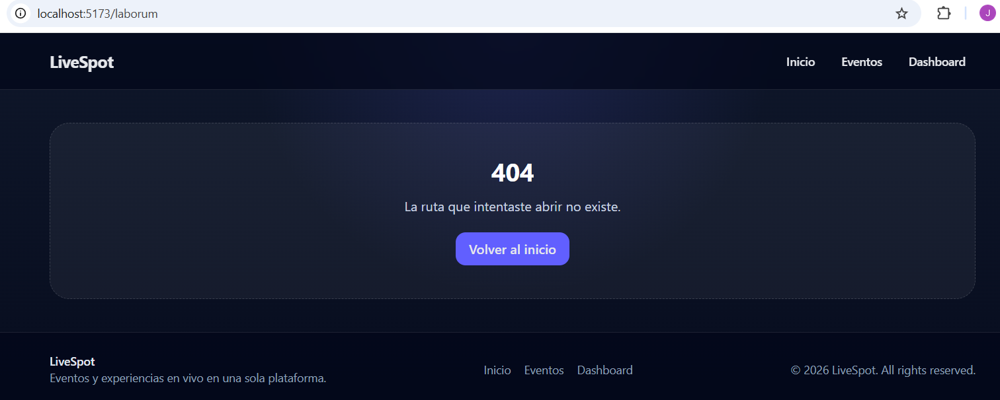

# LiveSpot

LiveSpot es un mini producto frontend orientado a la exploración, reserva y gestión inicial de eventos y experiencias en vivo desde una interfaz moderna, clara y responsiva.

El proyecto fue desarrollado como una propuesta de producto digital inspirada en plataformas de eventos y servicios tipo SaaS, con foco en experiencia de usuario, navegación fluida, componentización y mejora progresiva de arquitectura frontend.

---

## Demo del proyecto

> Aquí más adelante:

- enlace de despliegue
- capturas de pantalla
- GIF corto o video demo

---

## Descripción

LiveSpot permite descubrir eventos destacados, explorar un catálogo con búsqueda, filtros y orden, revisar el detalle de cada experiencia y reservar accesos desde una interfaz simple y moderna.

Además, incorpora un dashboard inicial que muestra métricas básicas del producto, próximos eventos y reservas recientes guardadas localmente, haciendo que la experiencia se sienta más cercana a un producto real y no solo a una maqueta visual.

---

## Funcionalidades actuales

- Página de inicio con presentación del producto y métricas conectadas a datos reales
- Sección de eventos destacados
- Catálogo de eventos
- Búsqueda por nombre o anfitrión
- Filtro por categoría
- Filtro por estado
- Orden de eventos por distintos criterios
- Vista de detalle dinámica por evento
- Formulario de reserva con validación
- Persistencia local de reservas mediante `localStorage`
- Dashboard con métricas, próximos eventos y reservas recientes
- Navegación entre rutas con React Router
- Interfaz responsiva construida con Tailwind CSS
- Componentes reutilizables para mejorar consistencia y mantenibilidad
- Página 404 para rutas no válidas

---

## Tecnologías utilizadas

- React
- Vite
- React Router
- Tailwind CSS
- JavaScript
- localStorage

---

## Arquitectura del proyecto

LiveSpot está organizado como una SPA frontend construida con React, Vite y Tailwind CSS, con una estructura separada por vistas, componentes reutilizables, datos y utilidades compartidas.

### Árbol principal del proyecto

```text
src/
│   App.jsx
│   index.css
│   main.jsx
│
├── assets/
├── components/
│   ├── EventCard.jsx
│   ├── EventFiltersBar.jsx
│   ├── InfoCard.jsx
│   ├── Layout.jsx
│   └── ReservationForm.jsx
│
├── data/
│   └── events.js
│
├── pages/
│   ├── DashboardPage.jsx
│   ├── EventDetailPage.jsx
│   ├── EventsPage.jsx
│   ├── HomePage.jsx
│   └── NotFoundPage.jsx
│
└── utils/
    ├── eventFormatters.js
    └── reservationStorage.js

```

## Organización por capas

- main.jsx: punto de arranque de la aplicación. Monta React, carga estilos globales y habilita 

la navegación con React Router.

- App.jsx: define el mapa principal de rutas de la aplicación.
- index.css: contiene la base visual global del proyecto.

Componentes

- Layout: estructura compartida de navegación y footer.
- EventCard: tarjeta reutilizable para mostrar eventos.
- EventFiltersBar: barra de filtros y orden del catálogo.
- InfoCard: componente reutilizable para métricas e información breve.
- ReservationForm: formulario de reserva desacoplado de la vista de detalle.

Vistas principales

- HomePage: portada conectada con datos reales del producto.
- EventsPage: catálogo con búsqueda, filtros y orden.
- EventDetailPage: detalle dinámico de evento + reserva.
- DashboardPage: panel con métricas, próximos eventos y reservas recientes.
- NotFoundPage: página 404 para rutas no válidas.

Datos y utilidades

- data/events.js: fuente local de datos de eventos.
- utils/eventFormatters.js: utilidades para presentar fechas y horas de forma consistente.
- utils/reservationStorage.js: persistencia simple de reservas con localStorage.

## Enfoque técnico

Durante la evolución del proyecto se trabajó con foco en:

- separación progresiva de responsabilidades
- componentización
- reutilización de lógica y UI
- mejoras de mantenibilidad
- experiencia de usuario más cercana a un producto real
- Decisiones técnicas destacadas

Durante la evolución del proyecto se aplicaron mejoras orientadas a hacer el código más limpio, mantenible y más cercano a una estructura real de producto frontend, por ejemplo:

- extracción de componentes reutilizables como EventCard, ReservationForm, EventFiltersBar e InfoCard
- separación de utilidades compartidas para formateo de fechas y persistencia local
- refactorización del dashboard para conectarlo a datos reales del proyecto
- mejora progresiva de la experiencia de usuario en filtros, formulario y navegación
- incorporación de persistencia simple con localStorage para dar mayor sensación de producto real

## Instalación y ejecución

1. Clonar el repositorio
git clone https://github.com/josecorrea01/livespot.git
2. Entrar al proyecto
cd livespot
3. Instalar dependencias
npm install
4. Ejecutar el servidor de desarrollo
npm run dev
5. Abrir en el navegador
http://localhost:5173/


## Capturas del proyecto

### Home



### Catálogo de eventos



### Catálogo con filtros activos



### Detalle de evento



### Formulario con validación de errores



### Reserva exitosa



### Dashboard con reservas



### Página 404




## Roadmap visual del proyecto

Base inicial
Estructura del proyecto con React + Vite + Tailwind
Home, catálogo, detalle, dashboard y 404
Navegación con React Router
Fuente local de datos de eventos

## Mejoras aplicadas

Extracción de EventCard reutilizable
Extracción de ReservationForm
Refactorización del dashboard para usar datos reales de events.js
Reutilización de InfoCard en distintas vistas
Utilidades compartidas para formateo de fechas
Filtro por estado en el catálogo
Orden de eventos
Persistencia de reservas con localStorage
Dashboard conectado a reservas recientes
Mejora de accesibilidad y UX del formulario
Mejora de UX y claridad de la barra de filtros
Home conectada a datos reales del producto

## Próximos pasos

- Despliegue público del proyecto
- Capturas y documentación visual del producto
- Pulido final responsive
- Mejoras adicionales de accesibilidad
- Evolución hacia integración con API o backend real

## Futuro posible

- Autenticación de usuario
- Perfil o historial más avanzado
- Dashboard más completo
- Tests básicos de componentes o utilidades
- Persistencia remota de eventos y reservas

## Estado del proyecto

LiveSpot se encuentra en una etapa funcional e intermedia, con una base sólida de frontend y varias mejoras de arquitectura ya incorporadas.

Actualmente el proyecto ya permite demostrar:

- navegación entre vistas
- renderizado dinámico
- filtros y orden
- formularios controlados y validación
- persistencia local
- componentización
- refactorización con foco en mantenibilidad
mejoras de UX y accesibilidad

## Aprendizajes del proyecto

Este proyecto me permitió reforzar especialmente:

- React y organización por componentes
- props, estado y renderizado condicional
- rutas dinámicas con React Router
- formularios controlados y validación
- reutilización de lógica y componentes
- separación progresiva de responsabilidades
- criterio de mejora arquitectónica en frontend
- conexión entre funcionalidad, producto y experiencia de usuario

## Autor

José Correa Herrera

- GitHub: [josecorrea01](https://github.com/josecorrea01)
- LinkedIn: [josecorreaherrera](https://www.linkedin.com/in/josecorreaherrera/)
- Correo: [josecorrea.electricidad@gmail.com](mailto:josecorrea.electricidad@gmail.com)